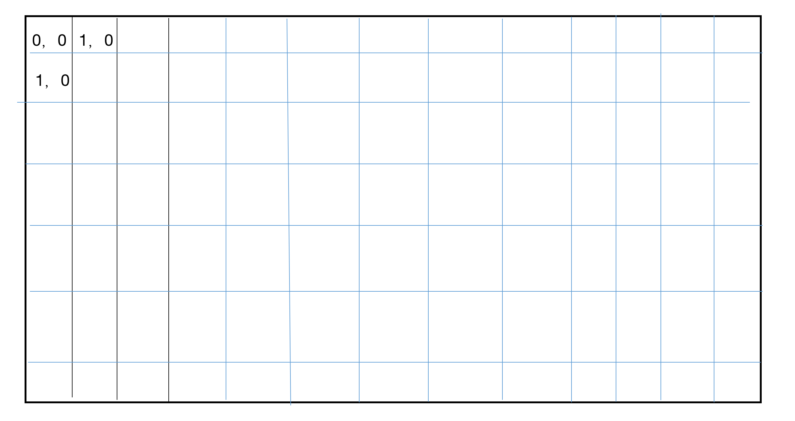

# tetris

## initial webpack project
pugin
- html-webpack-plugin
- clean-webpack-plugin
- webpack-dev-server
- ts-loader
- typescript

## 游戏开发
- 单一智能原则：每个类只做与他相关的事情
- 关闭原则：系统中的类，应该对拓展开放，对修改关闭

基于以上两个原则，系统中使用如下的模式
数据-界面分离模式（数据和界面解耦）

### 开发俄罗斯方块小方块类
```
export class Square {
    x: 0,
    y: 0,
    color: 'red'
}
```
Square 中x，y代表逻辑坐标

原则：
- 书写面向对象的class时，class中的属性全部私有化。需要修改的属性，使用公开的方法修改；


### 小方块的显示类，可以显示在手机、web ,不管是是什么框架实现都可以。以后只需要更改这个

### 方块的组合类
属性：
- x小方块的数组 不能发生变化   readonly
思考：该数组的成员从何而来
- 一个方块的组合：取决于组合的形状（坐标的相对位置的组合，该组合中有一个特殊坐标，表示形状的中心）
如果知道形状和中心点的坐标，可以确定所有的小方块的坐标

### 俄罗斯方块的生产者
